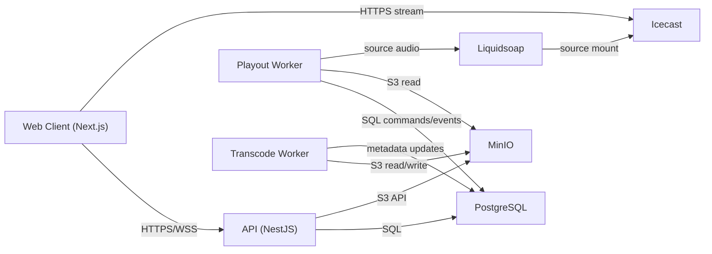

# Global Refactor Blueprint (v2)

## 1. Document Status

- Status: `PROPOSED`
- Project: `web-radio` (renamed product brand: `PINE`)
- Scope: Full platform refactor before production launch
- Constraint: **No CDN** in target architecture
- Last update: `2026-03-29`

---

## 2. Executive Summary

Current system works as a monolithic Node.js app with:

- SQLite state
- in-memory playback authority
- direct file streaming from API
- duplicated playback logic for authenticated and public listeners

This creates instability under restarts, race conditions in queue operations, and inconsistent client playback behavior (especially on Windows / slower networks).

### Target stack

- `PostgreSQL` (source of truth for queue and playback state)
- `MinIO` (object storage for tracks/covers/transcodes)
- `Liquidsoap` (playout engine)
- `Icecast` (stream delivery)
- `NestJS API` (control plane + auth + permissions + command bus + realtime events)
- `Next.js Web` (single unified playback client)

No CDN is used. Traffic is served directly via reverse proxy + Icecast.

---

## 3. Why Refactor Now

The project is not launched yet, so we can:

- introduce breaking API/schema changes safely
- remove legacy code instead of keeping compatibility hacks
- redesign queue/playback around deterministic server authority
- avoid expensive production migrations later

---

## 4. Current-State Findings (Critical)

## 4.1 Playback authority is process-local

- Playback state stored in gateway memory maps (`playbackStates`, timers, locks).
- Restart or horizontal scaling breaks continuity and consistency.

## 4.2 Queue operations are non-atomic

- Insert/reorder flows are multi-step and non-transactional.
- Concurrent actions can create invalid order.

## 4.3 Data model integrity gaps

- `Track.stationId` has no explicit Prisma relation to `Station`.
- Many enum-like fields are plain strings without strict DB constraints.

## 4.4 Contract drift

- WS payloads include fields not represented in shared TypeScript types.

## 4.5 Client architecture duplication

- Authenticated mode: WebSocket + Howler sync.
- Public mode: polling + native `<audio>`.
- Different paths lead to different bugs and inconsistent UX.

## 4.6 Delivery coupling

- API streams local files directly, mixing control plane and media plane.

---

## 5. Refactor Goals

1. Make playback deterministic and restart-safe.
2. Make queue operations serializable and race-proof.
3. Move media delivery out of API request lifecycle.
4. Unify client playback behavior for all listener modes.
5. Introduce production-grade observability and failure handling.
6. Keep architecture simple: **no CDN**.

---

## 6. Out-of-Scope (v2 initial cut)

1. Multi-region active-active distribution.
2. Personalized per-user audio timelines.
3. DRM and enterprise watermarking.
4. AI recommendation engine.

---

## 7. Target Architecture (No CDN)



## 7.1 Planes

- Control plane: API + Postgres + WebSocket events.
- Media plane: Liquidsoap + Icecast (+ MinIO as source).
- Background plane: workers for transcode, cover extraction, queue rebuilds.

## 7.2 Listener flow

1. Client joins station via API/WS.
2. Client receives station state + stream URL (`/live/{station_code}`).
3. Audio plays from Icecast mount.
4. UI metadata/progress are synced from server events/state snapshots.

---

## 8. Data Model v2 (PostgreSQL)

## 8.1 Core principles

- Strong relations and foreign keys everywhere.
- Enum types in DB for stateful fields.
- Append-only event log for observability/auditing.
- Explicit command queue for playback mutations.

## 8.2 New / revised entities

1. `users`
2. `stations`
3. `station_members`
4. `playlists`
5. `tracks`
6. `track_assets`
7. `queue_items`
8. `playback_state`
9. `playback_commands`
10. `playback_events`
11. `listen_sessions`
12. `chat_messages`
13. `activity_logs`

## 8.3 Suggested enums

- `station_access_mode`: `PUBLIC`, `PRIVATE`
- `queue_source`: `USER`, `SYSTEM`
- `queue_state`: `QUEUED`, `PLAYING`, `PLAYED`, `SKIPPED`, `FAILED`
- `command_type`: `PLAY`, `PAUSE`, `SKIP`, `SEEK`, `SET_LOOP`, `SET_SHUFFLE`, `QUEUE_ADD`, `QUEUE_REMOVE`, `QUEUE_REORDER`
- `command_state`: `PENDING`, `ACKED`, `REJECTED`, `EXPIRED`
- `stream_quality`: `LOW`, `MEDIUM`, `HIGH`
- `asset_kind`: `ORIGINAL`, `TRANSCODE_LOW`, `TRANSCODE_MEDIUM`, `TRANSCODE_HIGH`, `COVER_WEBP`, `WAVEFORM_JSON`

## 8.4 Queue constraints

- Unique ordered positions for queued items per station/source:
  - partial unique index on `(station_id, queue_source, position)` where `queue_state='QUEUED'`
- Supporting indexes:
  - `(station_id, queue_source, queue_state, position)`
  - `(station_id, queue_state, started_at desc)`

## 8.5 Playback state

One row per station:

- current queue item
- current track
- phase (`PLAYING`/`PAUSED`/`IDLE`)
- started_at / paused_at
- position_ms snapshot
- version (optimistic concurrency)
- updated_at heartbeat

## 8.6 Command/event model

- `playback_commands`: append-only input stream from API controls.
- `playback_events`: append-only output stream from worker decisions.
- API broadcasts WS events from `playback_events` (outbox pattern).

---

## 9. Queue Algorithm (v2)

## 9.1 Write lock strategy

Use per-station advisory lock in Postgres transaction:

```sql
SELECT pg_advisory_xact_lock(hashtext(:station_id));
```

Then perform all queue mutations atomically.

## 9.2 Add item (end/next/now/beforeItem)

1. Acquire advisory lock.
2. Resolve insertion index.
3. Shift affected queued items (`position + 1`) in one statement.
4. Insert new item.
5. Commit.
6. Emit `QUEUE_UPDATED` event.

## 9.3 Reorder

- Accept canonical ordered list.
- Reindex sequentially from `0..N-1` under advisory lock.
- Reject malformed payloads (duplicates, gaps, unknown IDs).

## 9.4 Recovery

- Startup task validates queue contiguity.
- Auto-repairs invalid positions if discovered.

---

## 10. Playback Logic (v2)

## 10.1 Authority

- Only playback worker can advance tracks and change canonical playback state.
- API writes commands; worker decides and commits transitions.

## 10.2 Removed behavior

- No client-originated `track_ended` authority.
- No in-memory-only station playback truth.

## 10.3 Optional behavior decision

Global `SEEK` for radio can be disabled by policy.

- Recommended default: allow `play/pause/skip`, disallow arbitrary seek in shared radio mode.

---

## 11. Media Pipeline

## 11.1 Upload path

1. API receives file metadata, stores original to MinIO.
2. DB `tracks` + `track_assets(kind=ORIGINAL)` records created.
3. Transcode job enqueued.

## 11.2 Background processing

- Worker extracts:
  - embedded cover
  - waveform data
  - duration/codec/bitrate metadata
- Worker writes derivatives to MinIO and upserts `track_assets`.

## 11.3 Playback source

- Liquidsoap reads selected asset URLs/paths from worker-provided source list.
- Sends live mount to Icecast.

## 11.4 Listener output

- Client consumes station mount from Icecast.
- Track metadata and progress from API WS/state.

---

## 12. API and Contract Changes

## 12.1 REST

Keep:

- auth endpoints
- station management
- membership and roles

Replace/adjust:

1. `GET /tracks/:id/stream` -> optional legacy endpoint, non-primary
2. New `GET /stations/:code/stream-info`:
   - mount URL
   - current metadata
   - latency hints
3. New command endpoint:
   - `POST /stations/:id/playback/commands`
4. New queue snapshot endpoint:
   - `GET /stations/:id/queue/snapshot`

## 12.2 WebSocket

Normalize and version payloads.

- `station:state:v2`
- `playback:sync:v2`
- `track:changed:v2`
- `queue:updated:v2`

Each event includes:

- `eventId`
- `stationId`
- `serverTime`
- `version`

---

## 13. Client Refactor

## 13.1 Single playback engine

- Remove dual behavior (guest polling vs auth Howler).
- Build one `StationPlayerEngine` used in all station views.

## 13.2 Audio strategy

- Prefer one persistent `HTMLAudioElement` for station stream.
- Keep Howler only if required for legacy fallback.
- Never create uncontrolled parallel instances.

## 13.3 Sync strategy

- UI clock based on `serverTime + offset` with EMA smoothing.
- Hard corrections only for control events, not every heartbeat.

## 13.4 UX resilience

- Explicit reconnect states:
  - `RECONNECTING_STREAM`
  - `BUFFERING`
  - `DESYNC_RECOVERING`

---

## 14. Security and Permissions

1. Keep station/member permission model.
2. Verify access for covers and assets consistently.
3. Signed MinIO URLs short-lived (if exposed directly).
4. Internal service credentials never sent to client.
5. Validate path/object ownership by station.

---

## 15. Observability and SRE

## 15.1 Logs

- Structured JSON logs (API + workers + playback)
- Mandatory fields: `service`, `stationId`, `commandId`, `eventId`, `traceId`

## 15.2 Metrics

1. Queue command latency (p50/p95/p99)
2. Playout command-to-audio latency
3. Stream availability by station
4. Rebuffer rate (client-reported)
5. Drift correction frequency

## 15.3 Alerts

1. No playback heartbeat > 10s
2. Queue lock contention spikes
3. Transcode backlog above threshold
4. Icecast mount unavailable

---

## 16. Deployment Topology (Docker, No CDN)

Services:

1. `postgres`
2. `minio`
3. `icecast`
4. `liquidsoap`
5. `api`
6. `web`
7. `media-worker`
8. `playback-worker`
9. `nginx` (reverse proxy / TLS termination)

Nginx routes:

- `/` -> web
- `/api` -> api
- `/live/*` -> icecast mounts

---

## 17. Monorepo Change Plan (File-Level)

## 17.1 Existing files to modify

| Path | Action | Notes |
|---|---|---|
| `apps/server/prisma/schema.prisma` | rewrite | PostgreSQL provider, enums, strict relations |
| `apps/server/src/prisma/prisma.service.ts` | update | pool/options for Postgres |
| `apps/server/src/main.ts` | update | health, graceful shutdown, worker-safe startup |
| `apps/server/src/app.module.ts` | update | new modules (playback, storage, jobs) |
| `apps/server/src/modules/queue/queue.service.ts` | rewrite | transactional queue + advisory lock |
| `apps/server/src/modules/queue/queue.controller.ts` | update | v2 payload validation and snapshot responses |
| `apps/server/src/modules/tracks/tracks.service.ts` | rewrite | MinIO-backed assets + job dispatch |
| `apps/server/src/modules/tracks/tracks.controller.ts` | update | remove direct file assumptions |
| `apps/server/src/modules/stations/stations.service.ts` | update | v2 state fields and stream info |
| `apps/server/src/modules/gateway/station.gateway.ts` | major rewrite | no in-memory playback authority |
| `packages/shared/src/types/index.ts` | rewrite | strict v2 WS/REST contracts |
| `packages/shared/src/constants/index.ts` | update | event names v2, timing constants |
| `apps/web/src/hooks/useStation.ts` | major rewrite | unified player engine and v2 sync |
| `apps/web/src/components/station/public-listen-player.tsx` | replace | merge into unified listener component |
| `apps/web/src/stores/station.store.ts` | update | versioned playback state + reconnect statuses |
| `apps/web/src/lib/api.ts` | update | v2 endpoints |
| `apps/web/src/lib/socket.ts` | update | v2 event namespace and ack patterns |

## 17.2 Existing files to deprecate/remove

| Path | Action | Notes |
|---|---|---|
| `apps/server/prisma/migrations/*sqlite*` | archive | kept only in legacy branch/tag |
| Legacy direct stream assumptions | remove | `/tracks/:id/stream` not primary path |
| Duplicate guest polling playback logic | remove | replaced by unified engine |

## 17.3 New files/modules to add

| Path | Purpose |
|---|---|
| `apps/server/src/modules/playback/playback.module.ts` | playback domain module |
| `apps/server/src/modules/playback/playback.service.ts` | command writes and state reads |
| `apps/server/src/modules/playback/playback.controller.ts` | playback commands API |
| `apps/server/src/modules/playback/playback.events.service.ts` | outbox/event emission |
| `apps/server/src/modules/storage/storage.module.ts` | storage abstraction |
| `apps/server/src/modules/storage/storage.service.ts` | MinIO/S3 client wrapper |
| `apps/server/src/modules/storage/storage.types.ts` | object key conventions |
| `apps/server/src/modules/jobs/jobs.module.ts` | queue/worker wiring |
| `apps/server/src/modules/jobs/transcode.producer.ts` | transcode job enqueue |
| `apps/server/src/modules/jobs/cover.producer.ts` | cover extraction job enqueue |
| `apps/playback-worker/*` | playback worker app |
| `apps/media-worker/*` | media worker app |
| `infra/docker-compose.yml` | local/prod-like orchestration |
| `infra/icecast/icecast.xml` | icecast config |
| `infra/liquidsoap/radio.liq` | liquidsoap script |
| `infra/nginx/nginx.conf` | reverse proxy routing |
| `docs/RUNBOOK_DEPLOY_V2.md` | deploy and restart runbook |
| `docs/RUNBOOK_INCIDENTS_V2.md` | incident response runbook |

---

## 18. Migration Strategy (Big-Bang, Pre-Launch)

Since production is not launched:

1. Build v2 in parallel branch.
2. Do not preserve backward compatibility unless cheap.
3. Reset test data as needed.
4. Validate end-to-end locally and on staging.
5. Switch default branch after quality gates.

## 18.1 Phases

1. `Phase A`: Data layer and contracts (Postgres schema + shared types)
2. `Phase B`: Queue/playback service rewrite
3. `Phase C`: Worker services + MinIO integration
4. `Phase D`: Liquidsoap/Icecast integration
5. `Phase E`: Web client unification
6. `Phase F`: Observability, hardening, load tests

## 18.2 Exit criteria per phase

- Each phase has:
  - lint/type-check pass
  - integration tests pass
  - manual smoke checklist completed

---

## 19. Testing Matrix

## 19.1 Automated tests required

1. Queue transaction tests (concurrency with parallel writers)
2. Playback command ordering tests
3. Permission checks (owner/admin/listener)
4. Asset lifecycle tests (upload -> transcode -> play -> delete)
5. WebSocket contract tests (snapshot + deltas)
6. Worker failure retry tests

## 19.2 Platform QA

Manual scenarios on:

1. macOS (Chrome/Safari)
2. Windows (Chrome/Edge)
3. Android Chrome
4. iOS Safari

Focus:

- track switch latency
- first-play gesture flow
- no silent gaps > threshold
- no timeline jumps without control commands

---

## 20. Performance Targets

1. Track switch audible gap: `< 1.5s` target, `< 3s` max
2. Queue command apply latency p95: `< 250ms`
3. Playback drift correction frequency: `< 1 hard correction / 60s` (normal network)
4. Stream startup time p95: `< 2.5s`

---

## 21. Reliability Targets

1. API availability: `99.9%`
2. Stream mount availability: `99.9%`
3. Zero lost queue commands on API restart
4. Recovery after worker restart without manual queue repair

---

## 22. Risk Register

| Risk | Impact | Mitigation |
|---|---|---|
| Liquidsoap/Icecast operational complexity | Medium | provide tested templates + runbooks |
| Queue deadlocks from bad transaction ordering | High | strict lock ordering + retries + telemetry |
| Client/browser autoplay restrictions | Medium | explicit "resume audio" UX path |
| Transcode backlog on low resources | Medium | worker concurrency controls + priority queues |
| Contract drift between API and Web | High | shared contracts + WS contract tests |

---

## 23. Definition of Done (Global)

Refactor is complete when:

1. API no longer owns direct primary media streaming logic.
2. Playback authority is DB+worker based, not memory-map based.
3. Queue writes are transactional and race-safe.
4. Web uses a single playback engine for all station listeners.
5. End-to-end load tests and platform QA pass.
6. Deployment and incident runbooks are documented and validated.

---

## 24. Execution Backlog (Checklist)

## 24.1 Data and contracts

- [x] Switch Prisma datasource to PostgreSQL
- [x] Introduce DB enums and strict FK relations
- [x] Add partial unique indexes for queued positions
- [x] Create `playback_state`, `playback_commands`, `playback_events`
- [x] Regenerate Prisma client and shared types

## 24.2 Server core

- [x] Replace in-memory playback authority in gateway
- [x] Implement command write API
- [x] Implement outbox/event broadcaster
- [x] Rewrite queue service under advisory lock transactions
- [x] Add station stream-info endpoint

## 24.3 Workers and media

- [x] Build media worker
- [x] Build playback worker
- [x] Integrate MinIO object keys and asset lifecycle
- [x] Integrate Liquidsoap source control
- [x] Integrate Icecast mount publishing

## 24.4 Web

- [x] Replace split playback logic with single engine
- [x] Add robust reconnect and buffering states
- [x] Add drift diagnostics in debug mode
- [x] Update queue/control flows for v2 commands

## 24.5 Ops

- [x] Add Docker Compose stack for v2
- [x] Add health checks and readiness probes
- [x] Add incident runbook (`RUNBOOK_INCIDENTS_V2.md`)
- [x] Add metrics dashboards and alerts
- [x] Finalize deploy runbook and rollback playbook

---

## 25. Suggested Implementation Order (Practical)

1. `schema + migrations`
2. `queue transaction correctness`
3. `playback command/event pipeline`
4. `MinIO track assets`
5. `workers (media/playback)`
6. `Icecast + Liquidsoap wiring`
7. `web unified player`
8. `observability + load testing`

This order minimizes rework and keeps correctness first.

---

## 26. Notes for Future (v3+)

1. Optional HLS fallback (still no CDN required).
2. Optional regional relay nodes (if audience scales).
3. Optional recommendation/auto-DJ intelligence.

---

## 27. Appendix: Official References

- Liquidsoap docs: <https://www.liquidsoap.info/doc-dev/>
- Liquidsoap book: <https://www.liquidsoap.info/book/book.pdf>
- Icecast docs: <https://www.icecast.org/docs/icecast-latest/>
- Icecast config reference: <https://www.icecast.org/docs/icecast-latest/config_file/>
- PostgreSQL explicit/advisory locking: <https://www.postgresql.org/docs/current/explicit-locking.html>
- Prisma PostgreSQL connector docs: <https://docs.prisma.io/docs/orm/core-concepts/supported-databases/postgresql>
- Docker Postgres image: <https://hub.docker.com/_/postgres>
- MinIO repository: <https://github.com/minio/minio>
