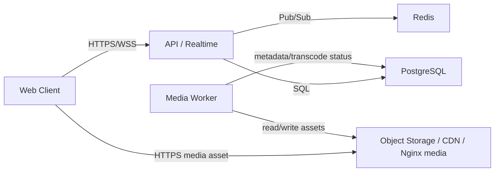

# Group Listening v3 - Technical Specification

## 1. Document Status

- Status: `PROPOSED`
- Project: `web-radio`
- Scope: group listening platform refactor for scalable direct-sync playback
- Last update: `2026-04-02`

---

## 2. Product Goal

Build a reliable group listening system where:

- every listener plays the track locally on their own device
- the server is authoritative only for room timeline and queue state
- users keep interactive shared controls: `play`, `pause`, `seek`, `skip`, `previous`, `next`
- the product can scale to many simultaneous listeners without sending all audio bytes through the API

This version fully replaces legacy broadcast-oriented playback. `DIRECT` becomes the only interactive playback mode.

---

## 3. Why We Are Doing This

The current platform has already moved toward direct local playback, but it still contains architectural leftovers from the old model:

- media delivery still depends on API byte streaming in hot paths
- there are still legacy concepts around `BROADCAST`
- command processing and synchronization remain more complex than required
- quality settings exist in UI and schema, but are not backed by a real transcode ladder
- scale is limited because the API remains too close to the media plane

As a result:

- simple actions can still feel heavier than they should
- playback quality controls are misleading
- scaling public/group listening to many users is harder than necessary

---

## 4. Core Principles

## 4.1 Single playback model

There must be exactly one playback model for all listeners:

- authenticated listeners
- public listeners
- mobile/desktop browsers

No separate public/player logic branches should exist at the product level.

## 4.2 Server controls timeline, not PCM stream

The server must own:

- current track
- current room playback version
- play/pause state
- authoritative seek position
- queue order
- permissions

The server must not continuously push position corrections unless a real control event occurred or the client is clearly desynchronized.

## 4.3 Audio delivery is not API responsibility

The API is a control plane, not a streaming proxy.

Track bytes must be served from object storage or edge delivery using signed/cacheable URLs. The application should be able to work:

- without CDN in development/self-hosted setups
- with CDN in production without changing client contracts

## 4.4 No legacy compatibility layer

This refactor intentionally removes old runtime paths instead of preserving them.

Anything tied to legacy broadcast behavior must be deleted, not hidden.

---

## 5. Problems in the Current System

## 5.1 API remains in the media data path

Today listeners request track audio through application endpoints. This couples control traffic and media traffic and creates a direct scaling bottleneck on:

- API egress
- reverse proxy throughput
- storage-to-API-to-client relay

## 5.2 Playback authority is more complex than needed

The system still uses a command/event pipeline designed to support more than the actual target product needs. For interactive direct group listening, this adds latency and makes debugging harder.

## 5.3 Quality controls are not real yet

The project stores quality-related enums and UI controls, but does not generate real playback variants. As a result:

- station quality buttons do not actually switch stream quality
- users may see a quality label that does not reflect actual delivery strategy

## 5.4 Legacy broadcast concepts pollute the domain

The data model and codebase still contain:

- `BROADCAST` playback mode
- old worker/runtime assumptions around live streaming
- UI and config surface that imply multiple playback architectures

This increases maintenance cost and makes the system harder to reason about.

---

## 6. v3 Goals

1. Keep group listening fully interactive with shared `seek/skip/pause`.
2. Make direct playback the only runtime model for rooms.
3. Move audio byte delivery out of the API hot path.
4. Introduce real quality variants that listener settings can control.
5. Reduce command latency and remove unnecessary polling complexity.
6. Support scalable public listening for rooms with many simultaneous listeners.
7. Keep playback smooth with proper staged `fade out -> apply change -> fade in` transitions.

---

## 7. Out Of Scope

1. DRM or protected streaming.
2. Personalized queue per listener.
3. Native mobile apps.
4. DJ/live microphone mode as the primary room playback model.

Separate live broadcast support may be added later as an additional mode, but it is not part of this refactor and must not shape the main direct-sync architecture.

---

## 8. Target Architecture

## 8.1 Architecture planes

- Control plane: API, auth, queue writes, playback state, permissions, websocket events.
- Media plane: object storage or CDN-backed file delivery for track variants.
- Background plane: metadata extraction, waveform, cover, transcodes.
- Realtime plane: Redis pub/sub or websocket adapter for multi-instance event fanout.

## 8.2 Listener flow

1. Client joins station and fetches initial state.
2. Client receives:
   - current playback snapshot
   - current track metadata
   - variant manifest or resolved media URL
3. Client starts local playback.
4. Client receives only discrete playback events:
   - `PLAY`
   - `PAUSE`
   - `SEEK`
   - `TRACK_CHANGED`
   - `QUEUE_UPDATED`
5. Client performs staged local transitions and keeps its own local clock between events.

---

## 9. Legacy Removal Requirements

The following must be removed from the product runtime:

1. `BROADCAST` as a supported station playback mode.
2. Broadcast-only workers from production runtime.
3. Any UI that suggests the app still supports old room playback modes.
4. Any player logic branch that exists only for public listeners.
5. Any quality selector that does not map to a real media variant.
6. Any periodic sync behavior that forcefully re-seeks active playback without an actual reason.

The following may remain only as historical code references during migration and must then be deleted:

- `broadcast.worker.ts`
- old Liquidsoap/Icecast deployment assumptions for room playback
- dead enums and settings tied only to removed runtime

---

## 10. Domain Model

## 10.1 Station playback state

Each station must have exactly one authoritative playback state row with:

- `stationId`
- `currentTrackId`
- `currentQueueItemId`
- `phase`: `IDLE | PLAYING | PAUSED`
- `version`
- `startedAt`
- `pausedPositionMs`
- `currentTrackDurationMs`
- `updatedAt`

## 10.2 Queue state

Queue remains authoritative on the server. All queue mutation operations must remain transactional and serialized per station.

## 10.3 Track asset model

Each track must support multiple assets:

- `ORIGINAL`
- `TRANSCODE_LOW`
- `TRANSCODE_MEDIUM`
- `TRANSCODE_HIGH`
- `COVER_WEBP`
- `WAVEFORM_JSON`

Each asset must store:

- storage key
- MIME type
- codec/container info when known
- bitrate
- sample rate when known
- file size
- readiness status

## 10.4 Variant manifest

The server must be able to return a playback manifest for a track:

- original asset availability
- supported variants
- recommended default variant
- whether original is lossless
- whether browser-safe fallback exists

## 10.5 Listener playback preference

Playback quality preference must belong to the listener session or user settings, not to the station itself.

Required preference modes:

- `AUTO`
- `LOW`
- `MEDIUM`
- `HIGH`
- `ORIGINAL` or `LOSSLESS` as an advanced option when supported

This replaces station-level runtime quality selection for direct playback rooms.

---

## 11. Media Delivery

## 11.1 Delivery strategy

The client must not rely on API-proxied audio as the primary delivery path.

Target path:

- API returns signed or cacheable media URLs
- client loads audio directly from storage/media domain
- URLs may be short-lived and refreshable

Acceptable deployment options:

1. Direct object storage signed URLs.
2. Nginx/X-Accel backed media gateway.
3. CDN over object storage.

The client contract must not depend on which backend option is used.

## 11.2 Caching

Current and next-track assets must be cache-friendly:

- stable asset identity
- `ETag`
- cache headers appropriate for private or public access mode
- browser reuse on replay/seek

## 11.3 Next-track preload

The client must preload the next track variant as soon as the queue head is known and playback is stable.

Preload must be canceled or refreshed if queue head changes.

---

## 12. Quality Strategy

## 12.1 User-facing requirement

Quality controls must actually affect playback delivery, but they must be scoped to the listener, not to the entire station.

Quality UI for direct playback must live in player-level or user-level settings, not in station administration settings.

## 12.2 Variant ladder

Minimum required generated variants:

- `LOW`: small, broad compatibility, mobile-friendly
- `MEDIUM`: balanced default
- `HIGH`: high quality lossy
- `ORIGINAL`: source asset when browser-supported

Recommended baseline:

- `LOW`: AAC or MP3 around `96 kbps`
- `MEDIUM`: AAC around `160 kbps`
- `HIGH`: AAC or MP3 around `256-320 kbps`
- `ORIGINAL`: untouched source asset

Exact codec choice can be adjusted during implementation, but Safari/Chrome/Firefox browser support must be considered first.

## 12.3 Browser compatibility rule

If the original asset is not confidently playable in the listener browser, the server/client must fall back to the best available compatible transcode.

This means:

- uploading FLAC may still preserve lossless storage
- listeners hear lossless only when original playback is supported
- otherwise they receive `HIGH` compatible transcode

## 12.4 Quality selection behavior

Each listener selects their own playback quality preference:

- `AUTO`
- `LOW`
- `MEDIUM`
- `HIGH`
- `ORIGINAL`

The server resolves the best playable asset for that listener based on:

- selected preference
- asset availability
- browser codec support
- access policy

Changing playback quality must:

- affect only the requesting listener
- never change playback quality for the rest of the room
- apply immediately on next track switch
- optionally rebind the current track only if this is implemented safely and tested explicitly

Initial v3 requirement: apply a new quality preference on next track switch. Do not force a hot asset swap on the current track in the first implementation slice.

---

## 13. Playback Command Processing

## 13.1 Simplification target

Interactive commands should be applied synchronously in the control plane under a per-station transactional lock.

This means the system should not depend on a polling worker just to process:

- `PLAY`
- `PAUSE`
- `SEEK`
- `SKIP`
- `PREVIOUS`
- `SET_LOOP`
- `SET_SHUFFLE`

## 13.2 Recommended command flow

1. Client sends command to API.
2. API validates permissions.
3. API opens transaction and acquires per-station advisory lock.
4. API loads current queue and playback state.
5. API computes new canonical state.
6. API updates `playback_state` and queue rows.
7. API writes `playback_event` outbox records.
8. API commits.
9. Event is broadcast to websocket listeners.

## 13.3 What still belongs in workers

Background workers should remain responsible for:

- metadata extraction
- waveform generation
- cover extraction
- transcodes
- queue repair tasks
- optional orphan cleanup

Playback commands from users should not require a worker roundtrip.

## 13.4 Audit trail

If command audit is desired, `playback_commands` may remain as an append-only log, but it must not be required for low-latency command execution.

---

## 14. Realtime Synchronization Model

## 14.1 State authority

Server is authoritative for:

- track identity
- playback version
- pause/play state
- seek target
- queue transitions

Client is authoritative only for its current local decoded playback position between control events.

## 14.2 Event model

Every playback event must contain:

- `stationId`
- `version`
- `eventType`
- `trackId`
- `isPaused`
- `trackStartedAt`
- `currentPosition`
- optional queue metadata

## 14.3 Snapshot model

Snapshot is used only for:

- initial join
- reconnect
- recovery after version gap

Regular operation must not depend on constant snapshot pushes.

## 14.4 Resync rules

Client must ignore stale events.

Client may perform authoritative hard resync only when:

- track id differs
- event version gap is detected
- explicit seek/skip/pause/play event requires it
- local drift exceeds configured threshold for sustained time

Normal websocket heartbeat or periodic sync tick must not cause repeated `currentTime` rewrites.

---

## 15. Client Playback Engine v3

## 15.1 Single engine

There must be exactly one client playback engine implementation used by:

- station owner
- authenticated listener
- public listener

UI shells may differ, but transport logic must be shared.

## 15.2 Engine responsibilities

The engine must handle:

- audio element lifecycle
- asset selection
- preload of current and next track
- transport transitions
- fade in / fade out
- local clock
- actual network/media loading detection
- browser autoplay blocking recovery

## 15.3 Engine state machine

Required states:

- `idle`
- `preparing`
- `playing`
- `paused`
- `transitioning_pause`
- `transitioning_seek`
- `transitioning_track_change`
- `buffering`
- `reconnecting`
- `blocked`
- `error`

## 15.4 Transition coordinator

All control events that can create audible artifacts must go through staged transitions.

### Pause

1. start fade out
2. pause audio
3. freeze local clock
4. do not show loading

### Seek on same track

1. fade out quickly
2. set `currentTime`
3. wait for readiness only if needed
4. fade in if target state is playing

### Track switch

1. fade out current track
2. clear transport tick from old track
3. swap source
4. reset visible position to `0`
5. wait for `canplay`
6. start at target offset
7. fade in

## 15.5 Fade architecture

Fade logic should use a dedicated transition gain layer rather than directly mixing user volume and transition volume in ad hoc code.

Recommended implementation:

- `masterGain`: user volume
- `transitionGain`: fade in/out automation

If full Web Audio gain-node migration is too large for first cut, the implementation may keep `audio.volume` temporarily, but the final target should separate persistent user volume from transient transition fades.

## 15.6 Loading UI rules

Loading indicator must be shown only when:

- current asset is not yet playable
- network buffering is actually occurring
- reconnect/recovery is in progress
- browser blocked autoplay and user action is needed

Loading indicator must not be shown for:

- pause fade out
- local seek transition already backed by cached media
- optimistic command wait
- normal fade-out/fade-in transition on track change unless media is not ready

---

## 16. Public Access Requirements

Public listeners must use the same transport engine and the same realtime flow as authenticated listeners.

Public mode differences are allowed only in:

- auth/permission model
- station access checks
- limited controls in UI

Public mode must not have:

- separate sync algorithm
- separate polling playback pipeline
- separate track timing logic

---

## 17. Server-Side Scale Requirements

## 17.1 Horizontal API scaling

The control plane must support multiple API instances.

Required for this:

- shared Postgres state
- websocket fanout through Redis
- no playback authority hidden in process-local maps

## 17.2 Media scaling

Large listener counts must not multiply API CPU and bandwidth linearly.

Required:

- direct media delivery outside Nest hot path
- cacheable assets
- optional CDN support

## 17.3 Target capacity planning

The system must be designed so that increasing listener counts primarily scales:

- media egress layer
- websocket fanout layer

and not core API request handlers.

---

## 18. Observability

## 18.1 Metrics

Required metrics:

- command latency by type
- websocket event fanout latency
- track switch preparation time
- time to first audio after track change
- buffer/waiting event frequency
- playback recovery frequency
- preload success rate
- media asset hit/miss by quality variant

## 18.2 Logs

Playback logs must include:

- station id
- playback version
- track id
- command type
- transition type
- resync reason
- asset variant chosen

## 18.3 Alerts

Minimum alerts:

- command latency above threshold
- high rate of playback recovery loops
- high asset error rate
- websocket delivery backlog
- missing transcodes for active playback quality

---

## 19. Performance Targets

Initial non-functional targets:

- `play/pause` control roundtrip p95: `< 250 ms`
- `seek` control roundtrip p95: `< 350 ms`
- `skip/next` to audible start p95 with preloaded next track: `< 800 ms`
- drift between active listeners in the same room p95: `< 500 ms`
- room join to first audio p95 on cached compatible asset: `< 2 s`
- no repeated audible loop segment after `seek`, `skip`, or `pause/resume`

These targets may be refined after real browser profiling.

---

## 20. Required Codebase Changes

## 20.1 Delete or retire

- broadcast-specific runtime code
- dead `BROADCAST` settings and UI
- station-level quality controls for direct playback rooms
- legacy worker-based command processing for interactive commands
- API primary byte-stream path for room playback
- duplicated public listener playback logic

## 20.2 Introduce or rewrite

- unified playback engine
- direct media manifest endpoint or station-state embedded asset manifest
- media variant selection layer
- listener quality preference setting
- transcode generation pipeline
- Redis-backed realtime fanout
- synchronous per-station command application path

## 20.3 Files/modules likely affected

- `apps/web/src/hooks/useStation.ts`
- `apps/web/src/hooks/useDirectPlaybackEngine.ts`
- `apps/web/src/components/station/public-listen-player.tsx`
- `apps/web/src/stores/station.store.ts`
- `apps/server/src/modules/stations/stations.service.ts`
- `apps/server/src/modules/playback/playback.service.ts`
- `apps/server/src/modules/playback/playback.controller.ts`
- `apps/server/src/modules/gateway/station.gateway.ts`
- `apps/server/src/modules/tracks/tracks.service.ts`
- `apps/server/src/modules/tracks/tracks.controller.ts`
- `apps/server/src/workers/media.worker.ts`
- `apps/server/prisma/schema.prisma`
- `packages/shared/src/types/index.ts`

---

## 21. Implementation Phases

## Phase 1 - Hard cleanup

- remove remaining runtime legacy around broadcast mode
- remove dead UI/settings surface
- freeze one shared playback contract

## Phase 2 - Media plane separation

- add track asset manifest
- move playback URLs away from API byte proxy
- support signed/cacheable direct asset delivery

## Phase 3 - Real quality ladder

- generate `LOW/MEDIUM/HIGH`
- store asset metadata per variant
- make listener quality settings actually affect playback choice

## Phase 4 - Command path simplification

- move interactive command handling to synchronous transactional API path
- keep outbox events for realtime broadcast
- demote old command polling worker path

## Phase 5 - Client engine finalization

- unify remaining playback engine logic
- formalize transition coordinator/state machine
- move fades to dedicated gain layer

## Phase 6 - Scale and reliability

- add Redis websocket fanout
- add metrics and dashboards
- run listener load tests

---

## 22. Acceptance Criteria

The refactor is accepted only when all statements below are true:

1. There is only one playback runtime mode for group listening.
2. Public and authenticated listeners use the same transport logic.
3. `pause`, `seek`, `skip`, and `track change` no longer create repeat-loop artifacts.
4. Track switch resets visible position correctly for all listeners.
5. Loading UI does not appear for local pause transitions.
6. Quality selector changes actual delivered media variant for the requesting listener on subsequent track switches.
7. API is no longer the primary audio byte delivery path.
8. System supports horizontal API scale without hidden in-memory playback authority.
9. FLAC/original uploads preserve source quality in storage and deliver original only when browser-compatible.
10. Next-track preload reduces perceived delay on `skip/next`.

---

## 23. Risks

1. Browser codec support differences may complicate `ORIGINAL` delivery.
2. Signed URL expiration must be handled carefully during long listening sessions.
3. Gain-node based fade implementation may require additional autoplay/user-gesture handling.
4. Moving command application from worker to API must preserve transactional correctness.
5. Real quality switching can become confusing if current-track hot-swap is attempted too early.

---

## 24. Recommended First Implementation Slice

The first major slice after this document should be:

1. finalize direct-only runtime cleanup
2. introduce media manifest and direct asset URL delivery
3. implement real transcodes in `media.worker`
4. wire listener quality preference to variant selection

This slice gives the biggest architectural payoff:

- real scale improvement
- real quality controls
- simpler API responsibility boundaries

After that, the second slice should simplify playback command execution and remove the remaining worker/polling dependency for user interactions.

---

## 25. Final Decision

The product should continue investing in direct synchronized local playback as the main architecture.

For this product, `group listening with shared controls` is the core experience. That experience is fundamentally better served by:

- local playback on each client
- authoritative server timeline
- discrete versioned control events
- storage/CDN media delivery

and not by a traditional continuous live stream architecture.
